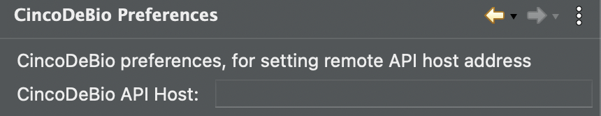

 <br/>
# CellMAPS <br/>
CellMAPS (Single-**Cell** **M**odel-based **A**nalysis **P**ipeline for **S**patial-omics) is a no-code processing and analysis workflow for high-dimensional spatial biology technologies, built in CincoDeBio. CellMAPS utilises a modelling environment (implemented in the Eclipse desktop app), in which workflows are developed, and an execution environment (implemented in a kubernetes native app), where these workflows are executed on the input data. Workflow modules include de-arraying, image normalisation, cell segmentation, feature extraction, spatial expression plotting, cell clustering, and more. The workflows are customisable depending on the use case. However, dataflow restrictions only allow workflows which are theoretically possible to be executed (e.g. cell clustering can not be performed before cell segmentation, etc.). CellMAPS can be used on Windows, Mac and Linux. The manuscript for CellMAPS can be found [here](https://www.biorxiv.org/) and the manuscript for CincoDeBio can be found [here](https://www.biorxiv.org/).

## Installation

At the moment, to use CellMAPS, both the modelling and execution environments must be downloaded and installed. We are currently working on merging the execution platform with [Cinco Cloud](https://link.springer.com/chapter/10.1007/978-3-031-19756-7_23) (a Kubernetes native Application) so in future versions the entire platform (modelling and execution platforms) will be combined and deployed together. <br /> <br />
Currently all the workflow modules for CellMAPS are stored on a public [docker hub](https://www.docker.com/products/docker-hub/) repository. In order to avoid rate limiting, the install will request valid a valid dockerhub account (username & password) which can be created [here](https://hub.docker.com/signup). 

### Windows 10/11

#### Prerequisites

Download and install the below:
* [Microk8s](https://microk8s.io/): The Kubernetes native application is deployed on a Microk8s cluster. Download the Windows version [here](https://microk8s.io/#install-microk8s). <br />
* Windows Subsystem for Linux (WSL) 2
  - The microk8s cluster is deployed with-in an Ubuntu-22.04 LTS instance running with-in WSL2
  - By default WSL enables a maximum of the 50% of the system RAM to be used (this can be changed be editing the .wslconfig file if needed)
  - **Please Note**: WSL will only work with system names (i.e. what you name your windows machine in settings) that contain lower-case charachters, numbers & hyphens.
  - To install WSL2, open up the command prompt and enter the below (you will need to restart your PC afterwards): ```wsl.exe --install```

#### Execution Platform (Windows 10/11)

Download the [powershell script](https://raw.githubusercontent.com/colm-brandon-ul/cdb-wsl-install/master/windows-wsl/deploy.ps1) which install the execution platform and it's dependencies.

Navigate to the folder which the powershell script was downloaded to, right click on the file and select the option 'Run with powershell as Admin'. If that option isn't present find the Powershell icon in the Windows menu, right click on it and select the option Run as administrator. Navigate to the folder the powershell script has been downloaded too with command cd <path/to/folder> replacing <path/to/folder> with the actual path folder on your machine. Finally run the command ```.\deploy.ps1```. (Note: If this fails run the command ```Set-ExecutionPolicy RemoteSigned``` then re-run the script using ```.\deploy.ps1```). <br />

The script will first install WSL2 (if not already installed) with an instance of Ubuntu-22.04 LTS. (If it exits and prints ```Hostname is invalid. Exiting.``` see note above about system names; Installation->Windows 10/11->Prerequisites->Windows Subsystem for Linux (WSL) 2). During the install of Ubuntu-22.04 LTS you will prompted to complete the ubuntu configuration (i.e. set username and password, etc..). Depending on your windows version this may launch in a new powerhsell window (once complete just return to the original powershell). If a new window isn't opened, once Ubuntu config is complete, enter ```CTRL+D``` to exit the Ubuntu terminal and continue with the install in powershell. The script will then configure Ubuntu so it can be used with CellMAPS, and restart WSL2. <br />

You will first be prompted to enter your DockerHub Username followed by your DockerHub Password (ensure these are correct as deployment will fail otherwise). <br />

Next the script will install microk8s. Note: By default WSL2 is deployed on the C: drive, once microk8s is installed this script will automatically move the WSL instance on the drive with the most available storage. It will then restart the cluster and install the various addons and configurations required for running the execution platform that will be deployed on the cluster. <br />

Finally the CellMAPS services will be deployed on the cluster. <br />

*The IP address for the cluster will be printed*. Please note this down as you will need to add it to the CellMAPS modelling environment so the modelling and execution environments can communicate with each other. The url to access to data-upload portal will also be printed.

#### Modelling Environment (Windows 10/11)

Download the [application](https://sourceforge.net/projects/cincodebio/files/ime.win32.x86_64.zip/download) and unzip it. The modelling environment can be launched by double clicking on ```hippoflowtool.exe``` in the unzipped folder. <br />

**Note**: Windows places restrictions on the maximum path length, therefore we recommending moving the zip file to the root directory ( C:/) before unzipping it, to avoid these errors.

#### Configure Java Virtual Machine (If Necessary)

The modelling environment requires Java 11 to be installed to on your machine to work. If you do not have a Java 11 already on your machine (and configured on your path) follow these instructions:

  1. Head to the [Temurin](https://adoptium.net/en-GB/temurin/releases/?version=11&package=jdk&os=windows&arch=any) website and select options from the dropdown for 'Architecture' to match your system (x64 for 64 bit Windows Systems).
  2. Download the JDK (.zip version), unzip it and rename the unzipped folder jre.
  3. Find the folder for the modelling environment, it should be named something like ```HippoFlowTool-1.202405081710```. Open it.
  4. Move/Copy the extracted jre folder (from step 2) into the ```HippoFlowTool-1.202405081710``` folder.

#### Add Execution Platform IP address to IME Preferences

In the modelling environment navigate to ```Hippoflow -> Setting -> CincoDeBio Preferences``` in the menu.

You should see a form like the one below:

 <br/>

Next, enter in the IP address (which was displayed when the execution platform was installed. Don't included http(s)://, etc.. Only the IP address (i.e. 0.0.0.0)

Hit **Apply and Close**.

Finally hit the ```Refresh CdB SIBs``` button on the top toolbar, this will synchronise the SIB palette with the set of SIBs available on the execution platform.
